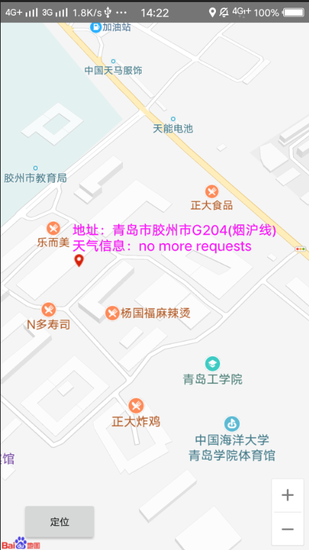
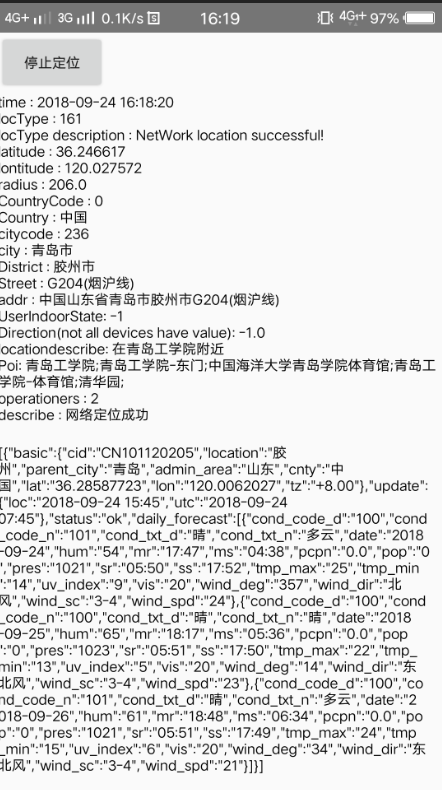

# android
学习安装自己写得一些小得Demo，基安卓第一行代码以及自己平时无聊写的一些小东西（UI有点丑，布局真的是个神奇的东西）

## ActivityIntent
 * 学习Intent的使用，是不同Activity相互唤醒的桥梁
 * 分为显式Intent和隐式Intent

## ActivityTest
 * 对于Android中的活动组件进行学习。
 * Android四大组件：
    * activity（活动）
    * service(服务)
    * content provider（内容提供者）
    * broadcastreceiver(广播接收器)

## BoradcastTest（手滑单词写错了，尴尬）
 * 广播学习

## BroadcastBestPractice
 * 推送通知，练习

## ContactsTest
 * 通讯录
 * 系统权限的获取
 * AndroidManifest.xml对于权限进行相关的配置

## FilePersistenceTest
 * 这是一个文件存储的功能
 * Android的数据持久化
 * 数据持久化的三种方法：
    * SharedPreferences
    * SQLite数据库
    * 作为文件保存

## FragmentBestPractice
 * 简单的来说这就是一个框架
 * 基于整个Activity作为View的承载单元
 * 优化框架

## FragmentTest
* 同上所述

## Helloword
* 这真的是一个Hello word，一个关于Android的Hello word!
* Hello Android!

## ListViewTest
* 简单的一个列表

## MoreInfo
* C.老究
* 山东大学生软件设计大赛
* 说是15天，其实写了两三天把
* 总的来说，Android的布局真的很强大
* 学习到的东西：适配器使用貌似很广泛啊。
#### bug
 * 布局肯定是首要的
 * 数据未进行持久化处理，每次访问需要请求一次数据
 * 论坛。。。emmmmm可能是用Android画了个原型图。可怕
    * 无法发帖（时间不够 and lazy）
    * 无法评论（布局头痛）
    * ......
* bug有点多，写出来丢人（有时间改改吧）

## MsgTest
* 按照《Android第一行代码》写的聊天窗口，简单~

## UICustomViews
* 博主自己布局的一个toolbar貌似。。。
* 有点丑，不是一般的丑😂

## UILayoutTest
* 同上

## UIWidgetTest
* 同上
* 可能同上吧！

## WeatherDemo
* 百度地图API
* 百度的Demo版本低了，我花了点时间跑起来，不给力，百度还是一家信息公司，非技术啊!
* 高德的Demo一下子跑起来了，有点可以啊，但是我还是用的百度的，哈哈哈，可能这就是菜鸟吧。
* 天气基于定位，实时获取，接口API使用的是和天气API
* UI没有美化，基于百度API定制的
   #### 2018年9月26日更新
   * 页面显示为整个地图
   * 定位可以显示当前地图
   * 定位位置可以添加自定义的MarkerOption
   * 见图: 
   
    

## firstActivity
* 首先，命名不规范，首字母大写
* 其次，这是我的第二个Activity
* 最后这没啥东西，就是HelloAndroid吧！

## Caulter

* 这是一个计算机，特别简单的那种。

## Note

* 哈哈哈，此生又一次写的极其丑陋的备忘录
* 布局这个东西为啥没有专人写呢。

## flutter是一个文件夹呀，基于flutter重新构建flutter

基于flutter构建

### flutter_1

学习的一个demo

学习Android接触到的一些东西，带有一点自己简单的理解，有不对的，烦请包涵、指正，谢谢！🤩
